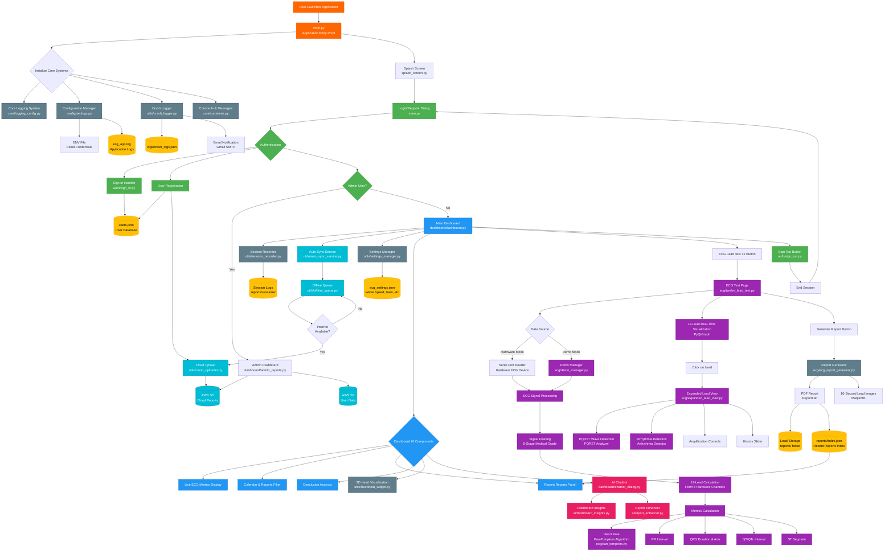
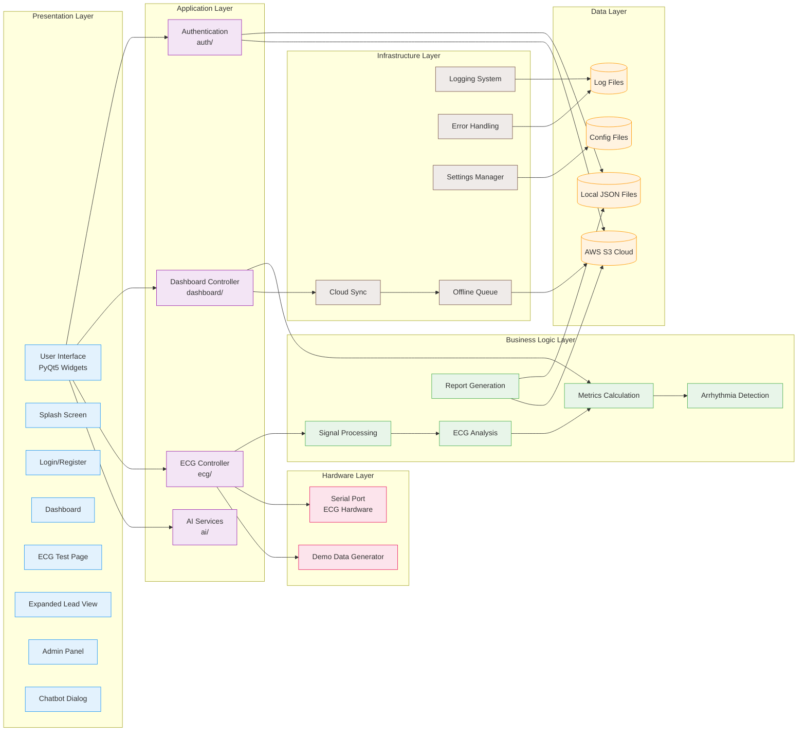
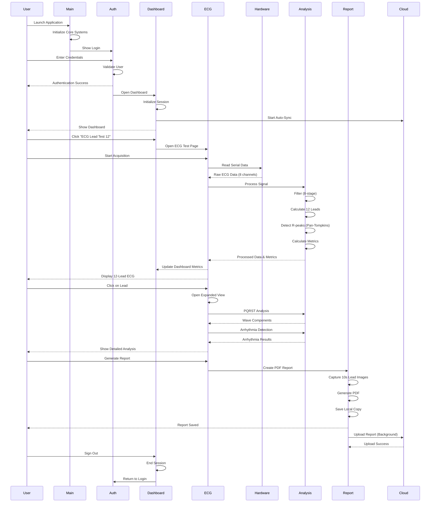

# ECG Monitor Application - End-to-End Architecture

## System Architecture Diagram



---

## Component Layer Diagram



---

## Data Flow Diagram



---

## File System Structure

```
modularecg/
├── src/                                    # Main source code
│   ├── main.py                             # ⭐ Application Entry Point
│   ├── splash_screen.py                    # Splash screen UI
│   │
│   ├── auth/                               # 🔐 Authentication Module
│   │   ├── sign_in.py                      # User sign-in logic
│   │   └── sign_out.py                     # User sign-out logic
│   │
│   ├── dashboard/                          # 📊 Dashboard Module
│   │   ├── dashboard.py                    # Main dashboard UI & controller
│   │   ├── admin_reports.py                # Admin panel for cloud reports
│   │   └── chatbot_dialog.py               # AI chatbot interface
│   │
│   ├── ecg/                                # 💓 ECG Processing Module
│   │   ├── twelve_lead_test.py             # 12-lead ECG visualization
│   │   ├── expanded_lead_view.py           # Detailed lead analysis
│   │   ├── demo_manager.py                 # Demo mode data generator
│   │   ├── recording.py                    # Recording panel UI
│   │   ├── pan_tompkins.py                 # R-peak detection algorithm
│   │   └── ecg_report_generator.py         # PDF report generation
│   │
│   ├── ai/                                 # 🤖 AI Services Module
│   │   ├── dashboard_insights.py           # Dashboard AI insights
│   │   └── report_enhancer.py              # Report enhancement AI
│   │
│   ├── utils/                              # 🔧 Utility Module
│   │   ├── crash_logger.py                 # Crash logging & email alerts
│   │   ├── session_recorder.py             # Session recording
│   │   ├── cloud_uploader.py               # AWS S3 upload handler
│   │   ├── auto_sync_service.py            # Background sync service
│   │   ├── offline_queue.py                # Offline data queue
│   │   ├── settings_manager.py             # Settings persistence
│   │   ├── heartbeat_widget.py             # 3D heart visualization
│   │   ├── helpers.py                      # Helper functions
│   │   └── backend_api.py                  # Backend API client
│   │
│   ├── core/                               # ⚙️ Core System Module
│   │   ├── logging_config.py               # Logging configuration
│   │   ├── exceptions.py                   # Custom exceptions
│   │   ├── constants.py                    # Application constants
│   │   └── validation.py                   # Data validation
│   │
│   └── config/                             # 📝 Configuration Module
│       └── settings.py                     # Config loader & manager
│
├── reports/                                # 📄 Generated Reports
│   ├── *.pdf                               # PDF ECG reports
│   ├── index.json                          # Recent reports index
│   ├── metrics.json                        # Metrics data
│   ├── upload_log.json                     # Cloud upload log
│   └── sessions/                           # Session recordings
│       └── session_*.jsonl                 # Session data files
│
├── logs/                                   # 📝 Application Logs
│   ├── crash_logs.json                     # Crash reports
│   └── session_*.log                       # Session logs
│
├── assets/                                 # 🎨 Static Assets
│   ├── v.gif                               # Background animation
│   ├── v1.png                              # Login image
│   └── heart.png                           # Heart icon
│
├── users.json                              # 👥 User database
├── ecg_settings.json                       # ⚙️ ECG settings
├── ecg_app.log                             # 📊 Application log
├── .env                                    # 🔒 Environment variables (AWS)
└── requirements.txt                        # 📦 Python dependencies
```

---

## Technology Stack

### Frontend / UI Layer
- **PyQt5**: Desktop GUI framework
- **PyQtGraph**: Real-time ECG plotting
- **Matplotlib**: Static plot generation for reports

### Backend / Processing Layer
- **NumPy**: Numerical computations
- **SciPy**: Signal processing (filtering, peak detection)
- **Pan-Tompkins Algorithm**: R-peak detection

### Data Storage
- **JSON**: Local data storage (users, settings, reports index)
- **JSONL**: Session recording
- **AWS S3**: Cloud storage for reports and user data

### Report Generation
- **ReportLab**: PDF generation
- **Matplotlib**: ECG waveform images

### Communication
- **PySerial**: Serial port communication with ECG hardware
- **SMTP (Gmail)**: Email crash reports
- **Boto3**: AWS S3 API client

### AI & Analytics
- **OpenAI API**: Chatbot and insights generation
- **Custom Algorithms**: Arrhythmia detection, PQRST analysis

---

## Key Design Patterns

### 1. **MVC Pattern**
- **Model**: Data classes, JSON files, cloud storage
- **View**: PyQt5 UI components
- **Controller**: Dashboard, ECG controller classes

### 2. **Observer Pattern**
- Real-time ECG data updates to dashboard
- Metrics updates trigger UI refresh

### 3. **Singleton Pattern**
- Crash logger instance
- Settings manager instance
- Cloud uploader instance

### 4. **Factory Pattern**
- ECG signal generator (Hardware/Demo)

### 5. **Queue Pattern**
- Offline queue for cloud sync
- Background upload service

---

## Security Features

1. **Authentication**: Username/password login with serial ID
2. **Admin Access**: Separate admin credentials
3. **Environment Variables**: AWS credentials in `.env`
4. **Session Management**: Session recording and timeout
5. **Data Encryption**: HTTPS for cloud uploads

---

## Scalability Features

1. **Modular Architecture**: Easy to add new ECG leads or analysis algorithms
2. **Cloud Storage**: AWS S3 for unlimited report storage
3. **Offline Support**: Queue system for offline uploads
4. **Background Sync**: Non-blocking cloud synchronization
5. **Responsive UI**: Adapts to different screen sizes

---

## Error Handling

1. **Crash Logger**: Automatic crash detection and logging
2. **Email Notifications**: Admin email alerts on crashes
3. **Graceful Degradation**: Fallback modes for missing modules
4. **User Feedback**: Clear error messages and recovery options
5. **Session Recovery**: Auto-save and recovery mechanisms

---

## Performance Optimizations

1. **Real-time Processing**: 20-60 FPS ECG rendering
2. **8-Stage Filtering**: Medical-grade signal quality
3. **Cached Reports**: Recent reports index for fast access
4. **Background Sync**: Non-blocking cloud uploads
5. **Lazy Loading**: Components loaded on-demand

---

## Future Enhancements

1. ✅ **Completed**: 12-lead ECG, real-time analysis, cloud sync
2. 🔄 **In Progress**: AI insights, advanced arrhythmia detection
3. 📅 **Planned**: Multi-user collaboration, telemedicine integration
4. 💡 **Ideas**: Mobile app, wearable device integration

---

**Last Updated**: December 3, 2025  
**Version**: 2.0  
**Maintainer**: Deckmount Team

